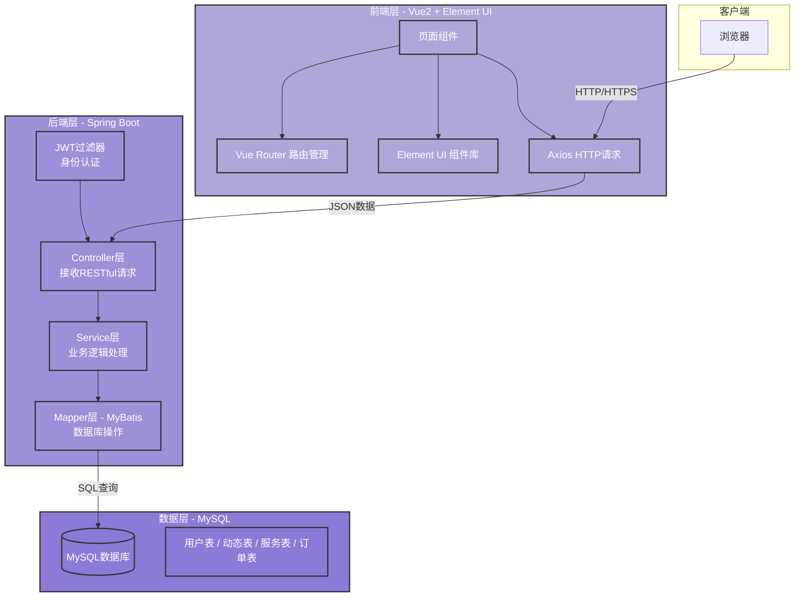

# 架构设计文档


## 技术选型

| 层级     | 选择             | 理由                                                    |
| -------- | ---------------- | ------------------------------------------------------- |
| 前端框架 | vue2+Element UI  | 团队成员更熟悉Vue2，Element UI组件库丰富，开发效率高    |
| 后端框架 | java+Spring Boot | 团队成员较熟悉该后端框架，且Spring Boot成熟稳定         |
| 数据库   | MySQL            | 与Spring Boot集成方便，项目数据间有关联，该数据库更适配 |
| 部署方式 | 本地运行（前期） | 项目初期以开发为主                                      |


## 架构图




## 前端目录结构

```
frontend/
├── public/                    # 静态资源
│   └── index.html             # HTML模板
├── src/
│   ├── assets/                # 图片、字体等资源
│   │   └── images/
│   ├── components/            # 通用组件
│   ├── views/                  # 页面组件
│   ├── router/                  # 路由配置
│   │   └── index.js
│   ├── App.vue                   # 根组件
│   └── main.js                   # 入口文件
├── package.json
└── vue.config.js                 # Vue配置文件
```


## 后端目录结构

```
backend/
├── src/main/java/com/pawhub/
│   ├── PawhubApplication.java    # 启动类
│   ├── controller/                # 控制层
│   │   ├── UserController.java    # 用户接口
│   │   ├── PostController.java    # 动态接口
│   │   ├── ServiceController.java # 服务接口
│   │   ├── OrderController.java   # 订单接口
│   │   └── SearchController.java  # 搜索接口
│   ├── service/                    # 业务层接口
│   │   ├── UserService.java
│   │   ├── PostService.java
│   │   ├── ServiceService.java
│   │   └── OrderService.java
│   ├── service/impl/               # 业务层实现
│   │   ├── UserServiceImpl.java
│   │   ├── PostServiceImpl.java
│   │   ├── ServiceServiceImpl.java
│   │   └── OrderServiceImpl.java
│   ├── mapper/                      # 数据访问层
│   │   ├── UserMapper.java
│   │   ├── PostMapper.java
│   │   ├── ServiceMapper.java
│   │   └── OrderMapper.java
│   ├── model/                        # 实体类
│   │   ├── User.java
│   │   ├── Post.java
│   │   ├── Service.java
│   │   ├── Order.java
│   │   ├── Comment.java
│   │   └── Like.java
│   ├── config/                        # 配置类
│   │   ├── CorsConfig.java            # 跨域配置
│   ├── filter/                         # 过滤器
│   │   └── JwtFilter.java              # JWT认证过滤器
│   └── utils/                          # 工具类
│       ├── JwtUtil.java                # JWT工具
└── pom.xml                              # Maven依赖配置
```

