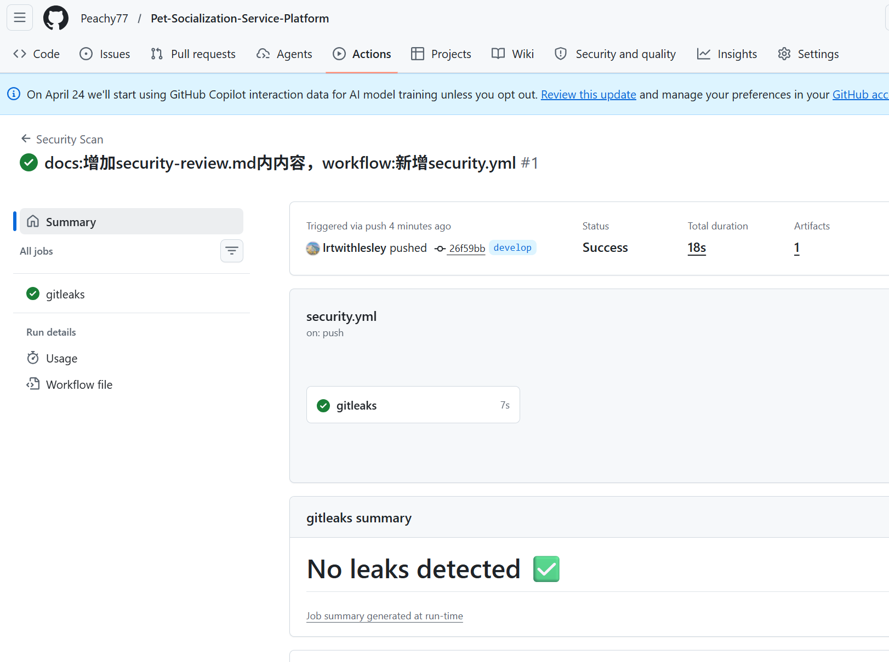

# 安全审查贡献说明

姓名：李若婷

学号：2312190234

日期：2026-5-6

## 我完成的工作

### 安全检查清单

- [x] **密码存储**：使用 bcrypt / argon2 哈希，不存明文
  - 部分完成，因为项目使用**MD5 + 固定盐值**的方式存储密码
- [x] **JWT / Session**：token 有过期时间，logout 后失效
  - 部分完成，token有过期时间，但logout只在前端删除token 
- [x] **接口鉴权**：所有需要登录的接口都有权限校验
- [x] **越权访问**：用户只能操作自己的数据（不能通过改 ID 访问他人数据）
- [x] **SQL**：使用 ORM 或参数化查询，无字符串拼接 SQL
- [x] **XSS**：前端输出用户数据时不用 innerHTML，或使用 DOMPurify
- [x] **API Key /** **密码**：不硬编码在代码中，通过环境变量读取
- [x] **.env** **文件**：已加入 .gitignore，仓库中有 .env.example
- [x] 运行依赖扫描，无高危漏洞（或已记录已知漏洞原因）
  - 部分完成，除**Spring Boot 2.7.6** 和 **Fastjson 1.2.83** 存在已知CVE 外，其余核心依赖（JJWT 0.11.5、OkHttp 4.12.0、MyBatis 2.3.0、Lombok 1.18.30）均无高危漏洞。

### CI 安全扫描

- 配置了选项A

- 扫描结果（通过）

  

  

## PR 链接

- PR https://github.com/Peachy77/Pet-Socialization-Service-Platform/pull/33

## 遇到的问题和解决

无

## 心得体会

​		在这次安全检查清单的实践中，我体会到安全并不是一项脱离于、次于开发的工作，而是应该融入到日常开发的每一个环节的工作。在 Vibe Coding 的高效迭代中，应该将安全固化为开发习惯，比如使用 ORM 防注入、环境变量管密钥等，在追求效率的同时兼顾实际项目的安全性，为以后投入市场的真正开发培养良好习惯。同时在这次实践中借助 AI 辅助审查模式化漏洞，可以在不牺牲效率的前提下，实现“安全左移”，让每一次提交都既敏捷又可靠。
